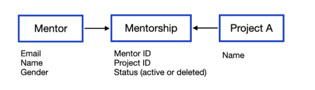

<details>

[](#description)
<a href="#description"></a>
<summary><span> :pencil: Description</span></summary>
This coding challenge consists of developing a simple Rest API using Django and Django Rest Framework. The exercise consists of writing a simple Django application, that has the following features in a Rest API:

- <strong>Models and relations</strong>. Create a model called Mentor, another one called Project, and another one called Mentorship. The models should have the following relationships(*) and fields:

<div align="center">



</div>

A Project can have multiple Mentors through the Mentorship Model. Also, a Mentor can have multiple Projects related to.

- <strong>Endpoints (urls.py)</strong>. Every model should have an endpoint that is accessible to make requests (create, update, delete mentors or projects).
- <strong>Views (views.py)</strong>. Every model should have an API Rest Viewset that allows all methods but Delete.
- <strong>Serializer (serializers.py)</strong>. Every model should have a Serializer that will return all the fields from the model and in the case of the ProjectSerializer, it should also return the array of Mentors related.
- <strong>(Optional) Admin (admin.py)</strong>. Extend the file so you can access these models and perform certain actions.
- <strong>(Optional +) Mentors Export</strong>. Add a third-party integration that enables Mentors Export in .csv from the Django Admin worked in the previous step.

</details>

<br>

<details>

[](#installation)
<a href="#installation"></a>
<summary> :floppy_disk: Installation</summary>

- ## :whale: Install Docker & Docker Compose

  https://docs.docker.com/get-docker/  
  https://docs.docker.com/compose/install/


- ## :closed_lock_with_key: Environment Variables

  To run this project, you will need to add the following environment variables regarding DB mapping to your .env file:

  `POSTGRES_NAME`

  `POSTGRES_USER`

  `POSTGRES_PASSWORD`

  <br/>And the following ones to setup an admin user for Django:

  `DJANGO_SUPERUSER_USERNAME`

  `DJANGO_SUPERUSER_EMAIL`

  `DJANGO_SUPERUSER_PASSWORD`

  `DJANGO_SECRET_KEY`

  <br/> A Boolean value for debugging session:

  `DEBUG`

  <br/>django app name and size number to perform DB model seeding:
  
  `DJANGO_APP`

  `SEED_SIZE`


- ## :wrench: Build and run container

  The first setup should use the <i>setup</i> script, which will build the Postgres server, make the first Db migrations for Django and create an Admin Superuser. During this setup a DB-model-seed option is enabled and can be used by setting a SEED_SIZE variable before executing the script. (ex: <i>SEED_SIZE=10 sh setup.sh</i>)

  ```bash
  sh setup.sh
  ```

  Following accesses to the Django server may just use the <i>start</i> script.

  ```bash
  sh start.sh
  ```

  Or enabling the Debugging session by setting a boolean variable:  
  ```bash
  DEBUG=1 sh start.sh
  ```

  (Optional) For a Django-app seed :arrow_right: <i>DJANGO_APP=<strong>django_app_name</strong> SEED_SIZE=<strong>desired_seed_size</strong> docker-compose -f DB-mgmt.yaml run db-seed:</i>  
  
  ```bash
  DJANGO_APP=mentors SEED_SIZE=10 docker-compose -f DB-mgmt.yaml run db-seed
  ```

  (Optional) For a Django db migration:  
  
  ```bash
  docker-compose -f DB-mgmt.yaml build db-migrations && docker-compose -f DB-mgmt.yaml run db-migrations
  ```

  (Optional) If a Django superuser is required for the first setup:  
  
  ```bash
  docker-compose run -f DB-mgmt.yaml superuser
  ```
</details>

<br>

<details>

[](#aproach)
<a href="#aproach"></a>
  <summary> :triangular_ruler: Approach</summary>

  Document in readme all along the process
  - Project Structure
  - External app architecture
  - DB models & relantionship definitions
  - Django-seed docker-compose service setup
</details>

<br>

<details>

[](#testing)
<a href="#testing"></a>
  <summary> :microscope: Testing</summary>

</details>

<br>

<details>

[](#bp)
<a href="#bp"></a>
  <summary> :cold_sweat: Blocking points</summary>

  - Django superuser automation. Switched from Dockerfile to docker-compose for dependency order purposes
  - Docker permissions management issues when using Docker & docker-compose. Copied folders from host drag host permissions. A chown command is required when unloading the code base into the container
  - Many to Many reversed relationship

</details>

<br>

<details>

[](#cud)
<a href="#cud"></a>
  <summary> :soon: Currently under develop</summary>

  - Mock a Prod / Dev setup with different docker-compose services point to differente data bases.
  - Create a more representative seed to be fed to db models eg JSON

</details>